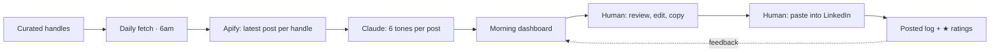
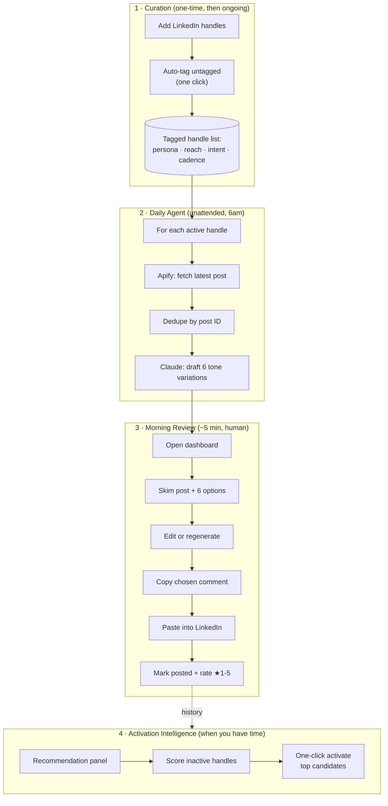
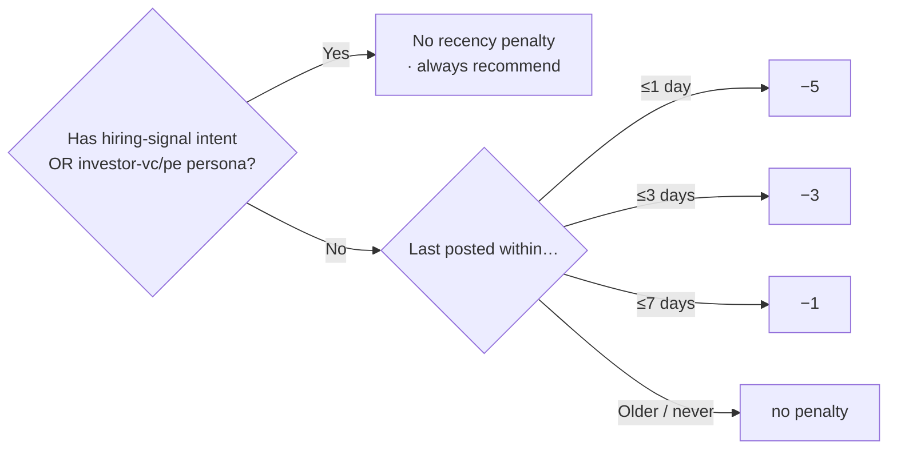
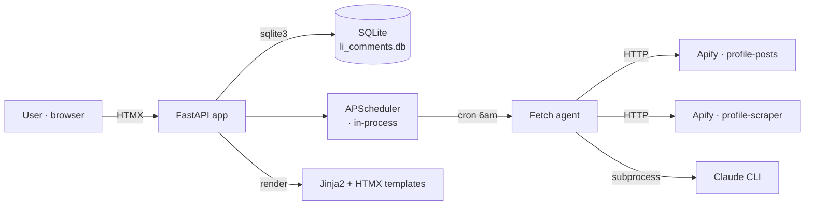
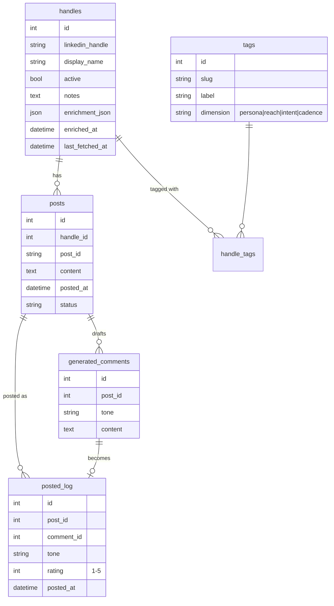

# LinkedIn Comment Generator — Application Overview

> A personal engagement-intelligence tool that turns the daily "scroll LinkedIn and try to comment on the right posts" chore into a 5-minute curated morning workflow. AI drafts six distinct comment options per post; the human picks, edits, and posts.

---

## The problem

Thoughtful LinkedIn engagement compounds — the people you helpfully respond to convert into opportunities, hires, and warm intros months later. But the daily mechanic is punishing:

- The feed is noisy; the people who matter are buried.
- Writing a fresh, on-tone comment five to ten times a day is decision fatigue.
- The engagement *strategy* lives only in your head — never structured, never searchable.
- Without a system, you over-engage some weeks and ghost others.

---

## The solution at a glance



Posting is always a human action — the app **never writes to LinkedIn**. This is intentional: it's a productivity tool, not a bot.

---

## End-to-end workflow



---

## Feature map — three user jobs

### 1 · Build & maintain a watch list
*Routes: `/admin`, `/admin/tags`*

Add LinkedIn handles, tag them across four dimensions, filter the list by tag, toggle each one active/inactive. The tag taxonomy itself is editable.

| Dimension | Why it matters | Examples |
|---|---|---|
| **Persona** | Drives tone selection | founder, ceo, recruiter, investor-vc, investor-pe |
| **Reach** | Drives comment-visibility ROI | mega (100k+), large (10–100k), mid, niche |
| **Intent** | Drives skip-or-prioritise decisions | prospect, network, hiring-signal, thought-leader |
| **Cadence** | Drives whether daily fetch is worth it | daily, weekly, sporadic |

### 2 · Generate daily comments
*Runs unattended at 6 am via APScheduler*

For each active handle: fetch latest post via Apify → dedupe → ask Claude to draft six comments, one per registered tone. All comments stored against the post.

The six tones (each independently editable in `/admin/tones`):

| Tone | Intent |
|---|---|
| **Operator** | Ground-level, practical execution perspective |
| **Strategic** | Big-picture, market or business angle |
| **Curious** | Question-led, invites dialogue |
| **Contrarian** | Respectful pushback or alternative view |
| **Affirming** | Builds on their point, adds a layer |
| **Concise** | One punchy sentence |

### 3 · Review & post
*Routes: `/dashboard`, `/posted`*

Two-pane dashboard: post on the left, six comment cards on the right. Each card supports copy / edit / mark-posted / regenerate. Posted comments get a 1–5★ rating; the `/posted` view aggregates by handle and tone so trends emerge.

---

## The intelligence layers (the executive-grade differentiators)

### A · Auto-tagging
One click ("Auto-tag untagged") calls Apify's profile scraper per handle, then:

- **Reach** — deterministic bucket from `followerCount`
- **Cadence** — median gap between recent posts → daily / weekly / sporadic
- **Persona** — Claude reads headline + current role + recent companies and picks 1–2 persona tags from a curated list
- **Display name** — reformatted to *"Name — Position, Company"* (with dedup when LinkedIn already embeds the company in the position)
- **Intent stays manual** — that's a strategic decision the human owns

### B · Activation intelligence

A scored recommendation panel surfaces dormant handles worth waking up today:

```
score = engagement + your-care + tag-strength − recency-cooldown
```

Every score is explained with on-screen "+/−" reason chips:

| Signal category | Examples |
|---|---|
| **Engagement** | `+3 posts:4`, `+2 rating 4.5★` |
| **Your-care** | `+2 notes`, `+1 display_name` |
| **Tag-strength** | `+3 prospect`, `+2 reach-large+`, `+1 persona`, `+1 cadence` |
| **Recency cooldown** | `−5 posted yesterday`, `−3 posted 2d ago`, `−1 posted 5d ago` |

Recency penalty is *waived* (`exempt:<reason>`) for high-signal intent:



Logic in plain English: *a recruiter who posted yesterday is still worth engaging today; a thought-leader who posted yesterday probably isn't.*

### C · Tone diversity
Six tones instead of one bland AI voice prevents tone-collapse. The mix means you always have a comment that fits the relationship.

### D · Compliance posture
The app reads via Apify (no login, no cookies) and writes nothing back to LinkedIn. All comment posting is a copy-paste action you take by hand.

---

## Architecture (one-glance)



| Layer | Choice | Why |
|---|---|---|
| Backend | FastAPI (Python) | One-process app with built-in scheduler |
| Frontend | Jinja2 + HTMX | Server-rendered, no React build pipeline |
| Database | SQLite (raw `aiosqlite`) | Single file, zero ops, sub-ms queries |
| Scheduler | APScheduler | In-process; no Redis/Celery |
| LLM | Claude CLI (subscription) | No per-call API cost |
| LinkedIn data | Apify actors | Read-only, no cookies |

The entire stack runs in one Python process against one `.db` file on a laptop.

---

## Data model (simplified)



---

## Talking points for an executive audience

| Question they'll ask | One-line answer |
|---|---|
| *What does this actually replace?* | The 60–90 minutes a day of scrolling, drafting, second-guessing comments. |
| *Isn't this just ChatGPT for LinkedIn?* | No — the value is in *curation* (handle watch list), *structure* (4-dimension tagging), and *prioritisation* (scored activation). The drafting is the easy part. |
| *Does it post for me?* | Never. Copy-paste only. Read-only on LinkedIn. |
| *Why six tones?* | Prevents AI tone-collapse and matches the relationship to the comment. |
| *How does it decide who's worth engaging today?* | Transparent scoring — every "+/−" is visible. You can override. |
| *Why a personal tool, not SaaS?* | The watch list and intent tags are *strategy* — they shouldn't leave your laptop. |

---

## Suggested diagram-generation prompts

Paste this file into Claude or ChatGPT with prompts like:

1. *"Render the end-to-end workflow as a single executive-friendly swimlane diagram with three lanes: System, Apify+Claude, Human."*
2. *"Turn the activation-scoring section into a one-page decision flowchart with the recency cooldown branches expanded."*
3. *"Generate a 1-slide summary illustrating the daily 5-minute loop, optimised for a non-technical audience."*
4. *"Convert the feature map into a 2×2 matrix of (Effort × Strategic Value), placing each feature in a quadrant."*

---

## Demo script — 90 seconds

1. **Open `/admin`** — "Here are the 26 people I track. Each has structure: persona, reach, intent, cadence."
2. **Hover the *Recommended to activate* panel** — "App scored these dormant handles. Score 11 on top: `+3 prospect, +5 posts:4, +2 reach-large, −1 posted 5d ago`. Math is on screen."
3. **Open `/dashboard`** — "This morning's posts. Each post, six comment options. I pick, edit if needed, copy."
4. **Paste into LinkedIn, mark posted, rate ★4** — "Done. 30 seconds per post. Ratings train my own sense of which tones land."
5. **Open `/posted`** — "Historical view. I can see which handles I'm engaging with too much, too little, and which tones rate best."
